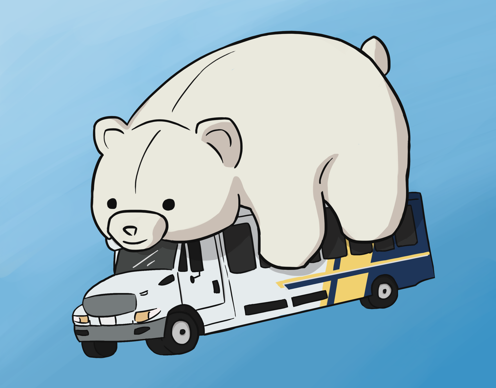
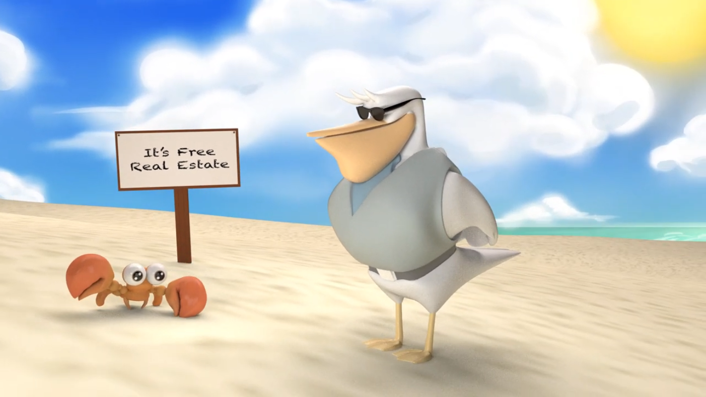
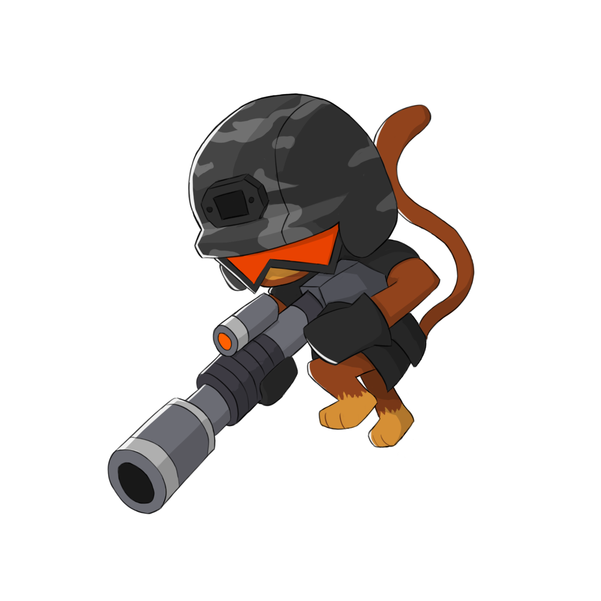

---
layout: page
title: Art
permalink: /art/
--- 

# __Art__

<section id="two">
    

        <article class="6u 12u$(xsmall) work-item">
            <h2>3D</h2>
        </article>
        <article class="6u$ 12u$(xsmall) work-item">
            <h2>2D</h2>
        </article>
        <article class="6u 12u$(xsmall) work-item">
            
            <h3>UCBUGG: MUFFINAAA</h3>
        </article>
        <article class="6u$ 12u$(xsmall) work-item">
            
            <h3>Sticker Shop</h3>
        </article>
        <article class="6u 12u$(xsmall) work-item">
            
            <h3>UCBUGG: It's Free Real Estate</h3>
        </article>
        <article class="6u$ 12u$(xsmall) work-item">
            
            <h3>2D Art Dump</h3>
        </article>
    

    <!-- <ul class="actions">
        <li><a href="#" class="button">Full Portfolio</a></li>
    </ul> -->
</section>